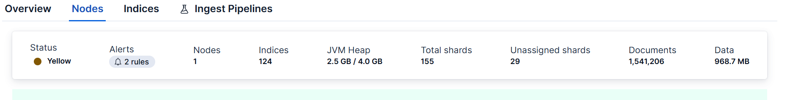
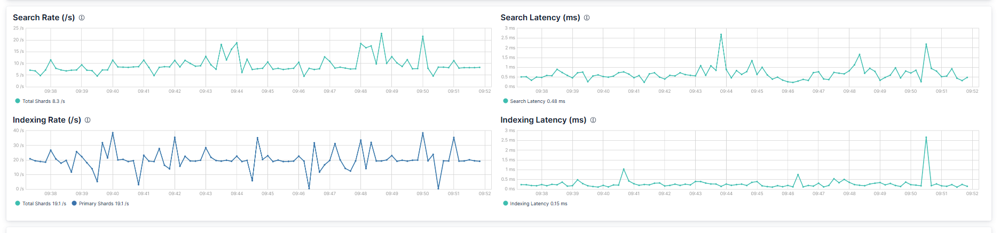
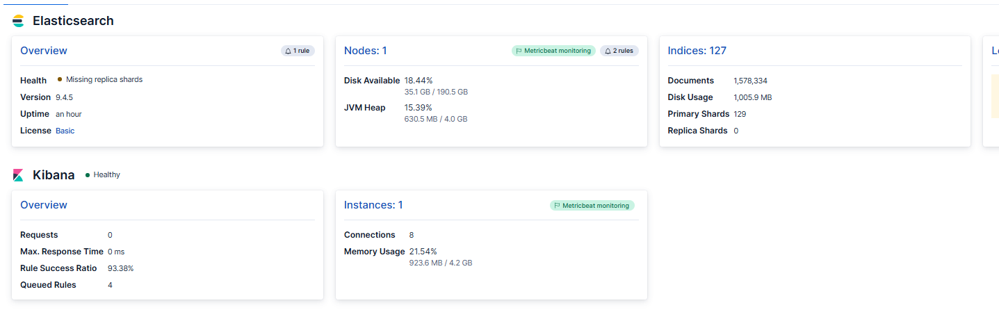

## Introduction to Metricbeat

- It is lightweight tool to collect system related metrics like
- eg CPU usage, Memory, disk, uptime.
- it is installed on server
- **ADV**
- light-weight and efficient, uses fewer system resources.
- 200+ integrations that can monitor system
- Very secure
- continuously collect metrics.
- **Usage**
- collect data form
  operating system/infra: getting data about memory and disc space.
  Application: Application performance and response time and  error
  database,
  webserver and containers.
- Capacity Planning: check metric and we can decides when more resources are required.

### Metricbeat Architecture & Components

Source => metric beat => elastic search => Kibana

### modules and metric set

- multiple ready-made modules are present for different services
- eg, Docker, Elastic search, Nginx, mySQL
- the module contains different metric-set to get specific data,
- e.g
- 1. System module: can collect data about CPU, memory.
  2. Elasticsearch module: cluster heath, active shards, node memory, disk usage, document count.
  3. Kibana: Health, response time, memory usage, request rate.

### Processors

- it modifies the data before sending it to the logstash or es.
- Add, remove, rename, drop

### Autodiscover

- It detects new services and containers and start monitoring.
- it is used in dynamic environment like docker and kubernetes.

### Stack Monitoring?

- It is the feature to monitor elastic stack itself.
- used to check whether ES, Kibana, logstash, Beats / Elastic Agent, APM and other components working properly or not
- we can manage, cluster health, node performance, JVM heap, memory usage, Disk space ...etc
- architecture: Data sorce=> matricbeat=> ES=> Kibana => Kibana Dahboard

### why need Stack Monitoring?

- Proactive detection: High CPU, High JVM heap, GC pressure, Hot nodes, Shard imbalance
- Performance Monitoring: Search indexing
- Capacity plaining: we can monitor CPU, memory, disk to plan scaling storage accordingly.
- Cost management: monitor unnecessary resource usage and optimize infra.
- SLA monitoring: uptime, response time, performance.

### What Data Should We Monitor?

Cluster Health: Green / Yellow / Red status, Number of nodes, Unassigned shards, Relocating shards, Thread pool status,Node Metrics

- 
- 
- 

Check all the dashboards and there use.

### Common Issues We Can Detect

#### High JVM Heap

    - long Garbage collection (GC) stops
    - slow performance

#### Unassigned shards

    - Node failure
    - disk performance
    - Allocation restriction

#### Low Disk Space

    - Indexing can be affected.
    - Search performance can affected

#### Slow query

    - High search latency
    - High p95/p99

#### Circuit breaker Trips

    - circuit breaker protect ES from running out of memory
    - if trigger frequently, we need to check memory allocations

#### Node Instability

    - Network issue
    - node disconnections
    - Cluster state problem

#### indexing Bottleneck

    - slow bulk requests
    - high queues

#### Uneven Shard Distribution

    - to many shards are placed at one node
